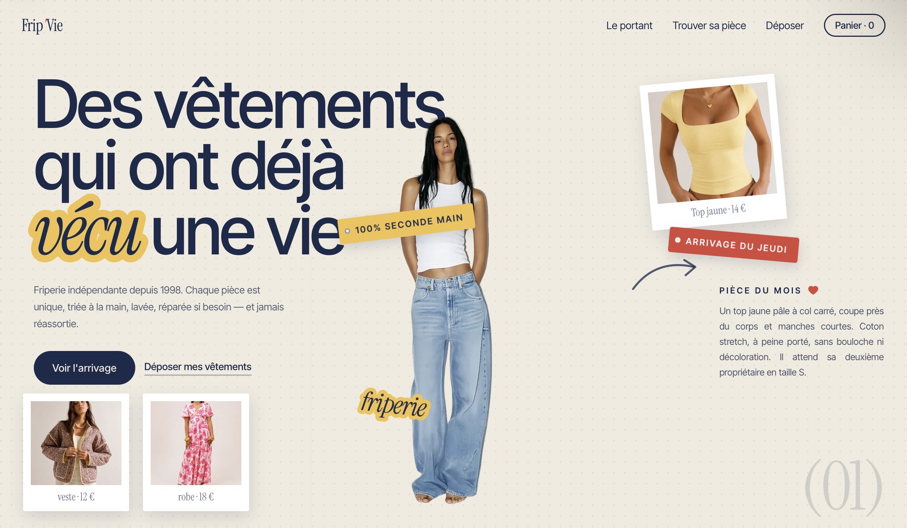

# Frip'Vie — Site vitrine de friperie

Site vitrine fictif pour une friperie indépendante, avec système de réservation
click & collect. Projet réalisé pour explorer les animations au scroll et
l'intégration d'un tunnel de réservation sans backend.

🔗 **[Voir la démo](https://fripvie.vercel.app/)**

## Le concept

Frip'Vie vend des vêtements de seconde main, chaque pièce étant unique et jamais
réassortie. Le site traduit cette idée en trois sections rythmées, avec une
identité visuelle inspirée des étiquettes de prix et de la mercerie.

## Fonctionnalités

- **Hero éditorial** — collage animé façon sticker, avec entrées séquencées au chargement
- **Section "L'arrivage"** — portant de vêtements qui se déploie au défilement (scroll-driven)
- **Section "Trouvez la pièce"** — six articles en orbite continue, pause au survol
- **Click & collect** — au clic sur une pièce, une fiche s'ouvre avec descriptif,
  taille et prix ; la réservation part vers la boutique via WhatsApp, paiement sur place
- **Navigation adaptative** — la barre change de couleur selon le fond de la section
- **Responsive** et respect de `prefers-reduced-motion`

## Choix techniques

- **HTML / CSS / JavaScript vanilla**, sans framework ni dépendance externe
- **Un seul fichier** autonome, images encodées en base64 (WebP)
- Animations au scroll pilotées à la main en JavaScript (calcul de progression + interpolation)
- Réservation sans backend : génération d'un lien `wa.me` pré-rempli
- Hébergé sur **Vercel**

## Ce que j'ai appris

Synchroniser plusieurs animations sur la même barre de défilement sans qu'elles
se chevauchent, et concevoir un tunnel de réservation utile pour un commerçant
sans serveur ni base de données.
